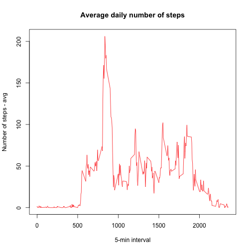

___________________________________________________________________________________________________________________________
This code is intended to cover the assignment for Project 1 on Course 5 under Data Scientist Specialization

This markdown document contains the complete code and plots required to answer particular questions
___________________________________________________________________________________________________________________________


```r
## Loading the Data
library(dplyr)
library(ggplot2)
library(lattice)
setwd("/Users/elobo/HomeRstudio/Curso5")
DataIn <- read.csv(unz("repdata-data-activity.zip", "activity.csv"),sep=",",na.strings = "NA")
```
### Question 1. What is mean total number of steps taken per day?

```r
        ## Cleaning missing values:
        DataIn <- DataIn[complete.cases(DataIn),]

        TotalSteps <- tapply(DataIn$steps, DataIn$date, sum)
        TotalSteps <- data.frame("steps" = TotalSteps[complete.cases(TotalSteps)])
        TotalSteps$date <- as.Date(rownames(TotalSteps))

        #Calculating mean of total steps by day
        mean(TotalSteps$steps)
```

```
## [1] 10766.19
```

```r
        #Calculating median of total steps by day
        median(TotalSteps$steps)
```

```
## [1] 10765
```

```r
        # Generating histogram 
        hist(TotalSteps$steps, main = paste("Histogram of Distribution of total steps"), xlab = "Range of steps", breaks=20)
        abline(v = mean(TotalSteps$steps), col="red", lw="3")
        abline(v = median(TotalSteps$steps), col="blue", lw="1")
```


### Question 2. What is the average daily activity pattern?

```r
        avg_by_inter <- data.frame("interval"=row.names(tapply(DataIn$steps, DataIn$interval, mean, na.rm=T)), 
                                   "steps"=tapply(DataIn$steps, DataIn$interval, mean, na.rm=T),
                                   stringsAsFactors = FALSE)
    
        ## Getting the plot for avg daily pattern
        with(avg_by_inter, plot(interval, steps, type = "l",
                            xlab = "5-min interval", 
                            ylab = "Number of steps - avg",
                            main = "Average daily number of steps", 
                            col = "red"))
```



Which 5-minute interval, on average across all the days in the dataset, contains the maximum number of steps?

```r
        # checks for the max avg value, then look for all interval in that day
        subset(avg_by_inter, steps==max(avg_by_inter$steps)) 
```

```
##     interval    steps
## 835      835 206.1698
```

### Question 3. Imputing missing values

```r
        ## Getting dataset with missing values
        DataIn <- read.csv(unz("repdata-data-activity.zip", "activity.csv"),sep=",",na.strings = "NA")
        Total_NA <- sum(is.na(DataIn$steps))
        message("Total Missing values in dataset is: ", Total_NA)
```

```
## Total Missing values in dataset is: 2304
```

```r
        ## Copying current dataset
        NewDataIn <- DataIn
        ## Filling in Missing Values into a new dataset:
        ## Getting sample of correct values of steps and then assign it to all NAs
        fillna <- sample (DataIn$steps[!is.na(DataIn$steps)], Total_NA, replace=TRUE) 
        NewDataIn$steps[is.na(DataIn$steps)] <- fillna
        
        # Total steps by day
        TotalSteps2 <- tapply(NewDataIn$steps, NewDataIn$date, sum)
        TotalSteps2 <- data.frame("steps" = TotalSteps2)
        TotalSteps2 <- mutate(TotalSteps2, date=as.Date(rownames(TotalSteps2)))

        # Make a histogram of the total number of steps taken each day and Calculate and 
        # report the mean and median total number of steps taken per day.

        hist(TotalSteps2$steps, main = paste("Histogram of Distribution of total steps"), xlab = "Range of steps", breaks=20)
        abline(v = mean(TotalSteps2$steps), col="red", lw="2")
        abline(v = median(TotalSteps2$steps), col="blue", lw="1")
```


Do these values differ from the estimates from the first part of the assignment? 
 <br />A: yes.
        
What is the impact of imputing missing data on the estimates of the total daily number of steps?
 <br />A: there is an increase in the total steps, however the distribution seems to keep confined to the same ranges
        
### Question 4. Are there differences in activity patterns between weekdays and weekends?

```r
        library(lubridate)
        NewDataIn$date <- as.Date(NewDataIn$date)
        NewDataIn$day <- weekdays(NewDataIn$date)
        NewDataIn$day <- wday(NewDataIn$date, label=TRUE)
        
        levels(NewDataIn$day) <- c("weekend", "weekday", "weekday", "weekday", "weekday", "weekday","weekend")
        
        stepsByDay <- aggregate(steps ~ interval + day, data = NewDataIn, mean)
        
        ## unsing lattice
        xyplot(steps ~ interval | day, data=stepsByDay, layout=c(1,2), type="l")
```


```r
        ## using ggplot
        g <- ggplot(stepsByDay, aes(interval, steps, colour=day))
        g + geom_line() + facet_grid( . ~ day) + theme_bw()  + labs(x="5-min Interval", y="Avg Steps [#]")
```


        
        A: Yes there is difference in pattern, showing a trend of more steps during weekend
        
